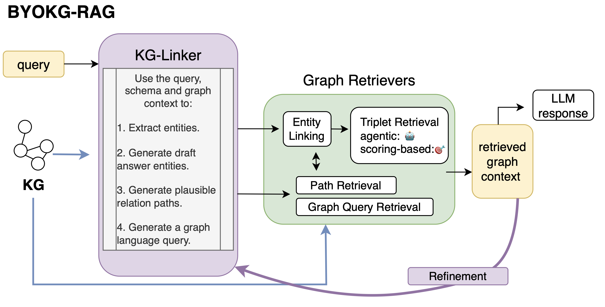

# BYOKG-RAG: Bring Your Own Knowledge Graph for Retrieval Augmented Generation 



BYOKG-RAG is a novel approach to Knowledge Graph Question Answering (KGQA) that combines the power of Large Language Models (LLMs) with structured knowledge graphs. The system allows users to bring their own knowledge graph and perform complex question answering over it.

## Key Features 🔑

- **Multi-strategy Retrieval**: Combines multiple retrieval strategies:
  - Agentic retrieval for dynamic graph exploration
  - Scoring-based retrieval for relevance ranking
  - Path-based retrieval for multi-hop reasoning
  - Query-based retrieval for direct graph queries
- **LLM-powered Reasoning**: Leverages state-of-the-art LLMs for question understanding and answer generation

## System Components ⚙️

1. **Graph Store** ([src/graphstore.py](src/graphstore.py))
   - Manages the knowledge graph data structure
   - Provides interfaces for graph traversal and querying

2. **KG Linker** ([src/graph_connectors.py](src/graph_connectors.py))
   - Links natural language queries to graph entities and paths
   - Uses LLMs to understand question intent
   - Extracts relevant entities and relationship patterns

3. **Entity Linker** ([src/graph_retrievers.py](src/graph_retrievers.py))
   - Matches entities from text to graph nodes
   - Handles variations in entity names
   - Uses fuzzy string matching for robust entity resolution

4. **Triplet Retriever** ([src/graph_retrievers.py](src/graph_retrievers.py))
   - Retrieves relevant triplets from the graph
   - Navigates the graph starting from linked entities
   - Verbalizes triplets in natural language format

5. **Path Retriever** ([src/graph_retrievers.py](src/graph_retrievers.py))
   - Finds paths between entities in the graph
   - Follows metapath patterns for structured traversal
   - Connects entities through intermediate nodes

6. **Query Engine** ([src/byokg_query_engine.py](src/byokg_query_engine.py))
   - Orchestrates all components
   - Processes natural language questions
   - Generates answers based on retrieved information

## Performance 📈

Our results show that BYOKG-RAG outperforms existing approaches across multiple knowledge graph benchmarks:

| KGQA Hit (%) | Wiki-KG | Temp-KG | Med-KG |
|--------------|---------|---------|--------|
| Agent        | 77.8    | 57.3    | 59.2   |
| BYOKG-RAG    | 80.1    | 65.5    | 65.0   |

*Note: Full paper with detailed methodology and results coming soon!* 📄

## Getting Started 🚀

1. Install dependencies:
```bash
pip install -r src/requirements.txt
```

2. Run the demo notebook ([byokg_rag_demo.ipynb](../examples/byokg-rag/byokg_rag_demo.ipynb)):
```
graphrag-toolkit/examples/byokg-rag/byokg_rag_demo.ipynb
```

## Citation 📚

*Coming soon!*

## License ⚖️

This project is licensed under the Apache-2.0 License.