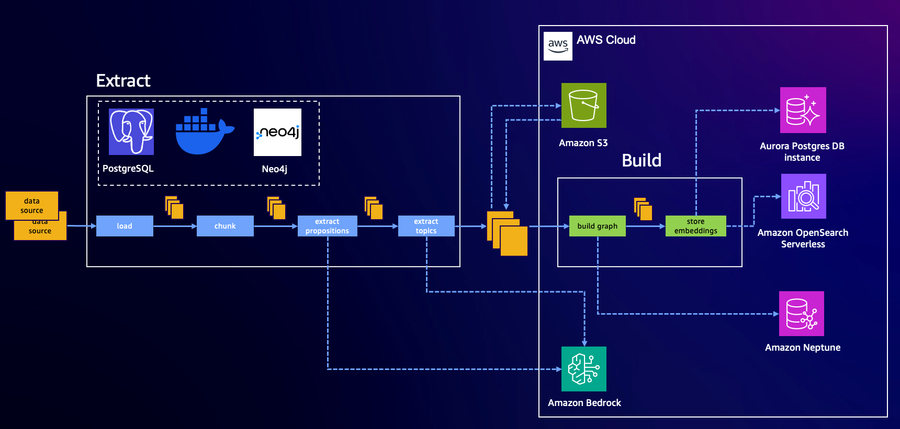

[[Home](./)]

## Hybrid Deployment

### Topics

  - [Overview](#overview)
  - [Stores and model providers](#stores-and-model-providers)
  - [Indexing and querying](#indexing-and-querying)
    - [Indexing](#indexing)

### Overview

Hybrid deployment enables flexible deployment: high-throughput LLM inference via SageMaker and Bedrock, and cost-effective local development using containerized graph/vector stores.

### Stores and model providers

The `lexical-graph` library depends on three backend systems: a [*graph store*](./storage-model.md#graph-store), a [*vector store*](./storage-model.md#vector-store), and a *foundation model provider*. The graph store enables storage and querying of a lexical graph built from unstructured, text-based sources. The vector store contains one or more indexes with embeddings for selected graph elements, which help identify starting points for graph queries. The foundation model provider hosts the Large Language Models (LLMs) used for extraction and embedding.

The library provides built-in support for:

* Graph stores: [Amazon Neptune Database](https://docs.aws.amazon.com/neptune/latest/userguide/intro.html), [Amazon Neptune Analytics](https://docs.aws.amazon.com/neptune-analytics/latest/userguide/what-is-neptune-analytics.html), and local [FalkorDB](https://falkordb.com/) (via Docker)
* Vector stores: [Amazon OpenSearch Serverless](https://docs.aws.amazon.com/opensearch-service/latest/developerguide/serverless.html), [PostgreSQL with `pgvector`](https://github.com/pgvector/pgvector), Neptune Analytics, and local [PostgreSQL with `pgvector`](https://github.com/pgvector/pgvector)
* Foundation model provider: [Amazon Bedrock](https://aws.amazon.com/bedrock/)

This hybrid configuration enables flexible deployment: high-throughput LLM inference via SageMaker and Bedrock, and cost-effective local development using containerized graph/vector stores.

### Indexing and querying

The lexical-graph library implements two high-level processes: [_indexing_](./indexing.md) and [_querying_](./querying.md). The indexing process ingests and extracts information from unstuctured, text-based source documents and then builds a graph and accompanying vector indexes. The query process retrieves content from the graph and vector indexes, and then supplies this content as context to an LLM to answer a user question.

#### Indexing

Indexing is split into two pipeline stages: **Extract** and **Build**.

The **Extract** stage runs **locally using Docker**:

* Loads and chunks documents
* Performs two LLM-based extraction steps:

  * *Proposition extraction*: Converts chunked text into well-formed statements
  * *Topic/entity/fact extraction*: Identifies relations and concepts
* Stores the extracted results in an **AWS S3 bucket**, serving as the transport medium between stages

The **Build** stage remains unchanged.

