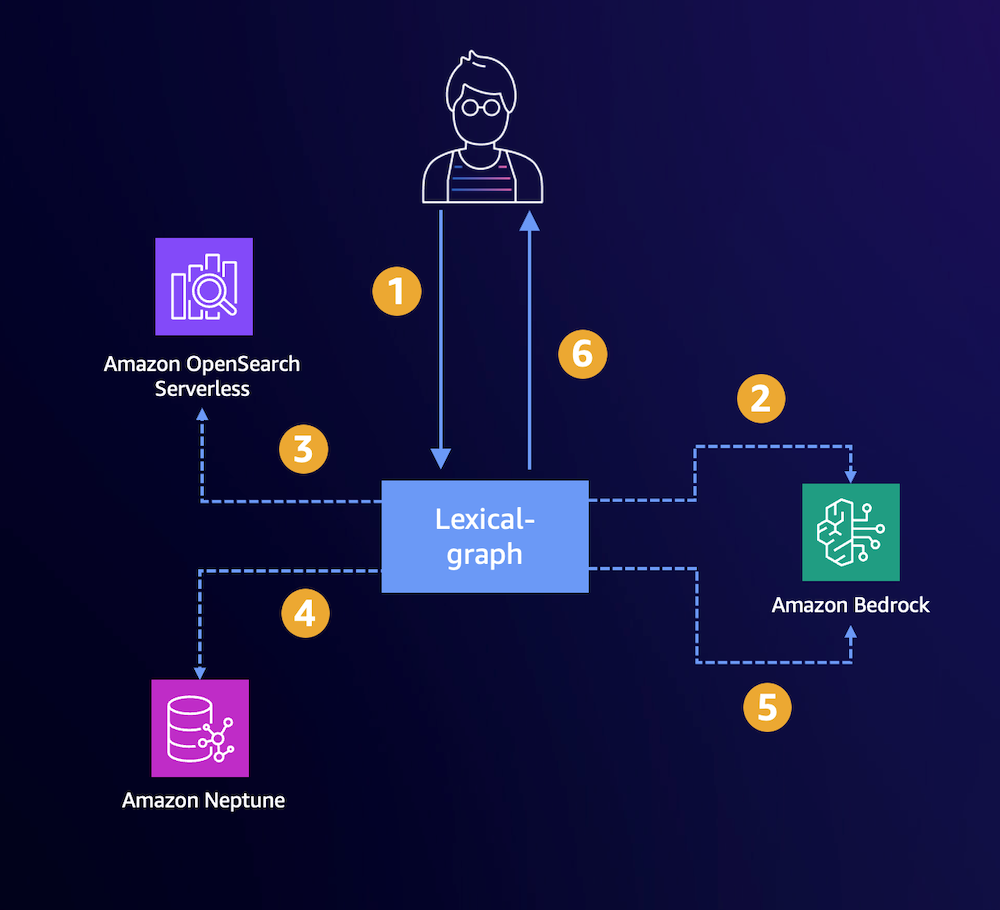

(cloud-overview)=

## Overview: Using SageMaker in the Cloud

The `graphrag-toolkit` {ref}`lexical-graph` library provides a framework for constructing a {ref}`graph-model` from unstructured data and composing question-answering strategies that query this graph.

### Stores and Model Providers

The library relies on three core systems:

* {ref}`graph-store`
* {ref}`vector-store`
* Foundation model provider (e.g., LLMs for extraction and embedding)

Built-in support includes:

* Graph stores: [Amazon Neptune Analytics](https://docs.aws.amazon.com/neptune-analytics/latest/userguide/what-is-neptune-analytics.html), [Amazon Neptune Database](https://docs.aws.amazon.com/neptune/latest/userguide/intro.html)
* Vector stores: Neptune Analytics, [Amazon OpenSearch Serverless](https://docs.aws.amazon.com/opensearch-service/latest/developerguide/serverless.html), PostgreSQL + pgvector
* Foundation model provider: Amazon Bedrock

### Indexing and Querying

Two high-level processes:

* {ref}`indexing`: Ingests and extracts information from source documents
* {ref}`querying`: Retrieves and supplies relevant content to an LLM

(indexing-pipeline)=

#### Indexing Pipeline

Split into two stages:

* {ref}`extract-stage`: Chunks, cleans, and extracts propositions, facts, topics, and entities
* {ref}`build-stage`: Builds graph and indexes embeddings

Extraction uses two LLM calls per chunk. Micro-batching supports storing results in S3, enabling inspection and transformation.

(querying-process)=

#### Querying Process

Consists of retrieval and generation:

* {ref}`semanticguidedretriever` for fine-grained queries
* {ref}`traversalbasedretriever` for broader queries

Steps:

1. Submit question to query engine
2. Embed query
3. Perform top-K vector search
4. Anchor graph queries with search results
5. Send content + query to LLM
6. Return generated response

(multi-tenancy)=

### Multi-Tenancy

Supports {ref}`multi-tenancy` to isolate graphs by domain, collection, or user.

(metadata-filtering)=

### Metadata Filtering

Supports constraints during:

* {ref}`metadata-filtering-index`
* {ref}`metadata-filtering-query`

Also usable during {ref}`metadata-filtering-build` stages.

(security)=

### Security

Users are responsible for securing data and AWS infrastructure. See {ref}`security` for IAM policy guidance. All requests are SigV4 signed over TLS 1.3.

(hybrid-overview)=

## Overview: Hybrid (Local Desktop + SageMaker)

### Stores and Model Providers

Same architecture, with added local support:

* Graph stores: Neptune DB, Neptune Analytics, local [FalkorDB](https://falkordb.com/)
* Vector stores: OpenSearch, PostgreSQL + pgvector, Neptune Analytics, local pgvector
* Foundation models: Amazon Bedrock

### Indexing and Querying

Same logic as cloud mode.

### Indexing

**Extract stage runs locally via Docker:**

* Loads/chunks
* Runs LLMs for proposition + fact/topic/entity extraction
* Stores output in S3

**Build stage** uses that output.

(getting-started)=

### Getting Started

Use one of the [CloudFormation templates](../cloudformation-templates) to provision:

* VPC
* Neptune + OpenSearch or Aurora
* SageMaker Notebook

Each stack deploys example notebooks:

* {ref}`cf-template-opensearch`: VPC, Neptune DB, OpenSearch Serverless
* {ref}`cf-template-aurora`: VPC, Neptune DB, Aurora Postgres
* {ref}`cf-template-aurora-vpc`: Neptune DB, Aurora Postgres in existing VPC
